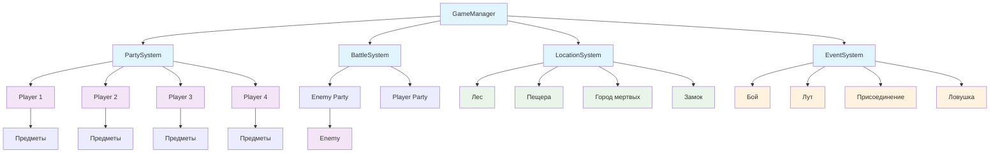

# Архитектура игры "The Hunter's Path" (Darkest Dungeon стиль)

## Обзор системы

Игра представляет собой пошаговую RPG в стиле Darkest Dungeon с элементами rogue-like. Основные компоненты:

### Основные сущности
- **Entity** - базовая сущность с характеристиками (HP, урон, защита, инициатива, выносливость)
- **Player** - игровой персонаж с инвентарем, экипировкой и системой уровней
- **Enemy** - враг с опытом за убийство и уровнем сложности
- **Item** - предметы (оружие, броня, аксессуары, расходники)

## Архитектурные компоненты

### 1. Система боя (BattleSystem)
```cpp
class BattleSystem {
private:
    vector<Entity*> playerParty;    // Отряд игрока (до 4 персонажей)
    vector<Entity*> enemyParty;     // Отряд врагов
    vector<Entity*> turnOrder;      // Очередь ходов (на основе инициативы)
    int currentTurnIndex;           // Текущий ход
    
    // Позиции на линии боя (0-3 для каждой стороны)
    vector<int> playerPositions;    
    vector<int> enemyPositions;
    
    // Трупы на поле боя
    vector<Entity*> playerCorpses;
    vector<Entity*> enemyCorpses;
};
```

**Механики боя:**
- Очередь ходов на основе инициативы (юнит с инициативой 20 ходит в 2 раза чаще)
- Позиционная система: атака только по доступным целям
- Трупы блокируют позиции (нужно "расчищать" для доступа к задним рядам)
- Ограниченное количество действий на ход (stamina)

### 2. Система локаций (LocationSystem)
```cpp
enum class LocationType {
    FOREST,         // Лес
    CAVE,           // Пещера  
    DEAD_CITY,      // Город мертвых
    CASTLE          // Замок (финальный босс)
};

class Location {
private:
    LocationType type;
    string name;
    string description;
    vector<Location*> connectedLocations;  // Связанные локации
    vector<Event*> possibleEvents;         // Возможные события
    bool isBossLocation;                   // Локация с боссом
};
```

**Структура навигации:**
```
Лес → Пещера, Город мертвых
Пещера → Замок, Город мертвых  
Город мертвых → Замок, Лес
Замок → Пещера, Лес (если не идти к боссу)
```

### 3. Система событий (EventSystem)
```cpp
enum class EventType {
    COMBAT,         // Бой с врагами (60% вероятность)
    TREASURE,       // Находка лута (20% вероятность)
    RECRUIT,        // Присоединение нового персонажа (10% вероятность)
    TRAP,           // Ловушка (5% вероятность)
    REST,           // Отдых/восстановление (5% вероятность)
    BOSS            // Босс-битва (только в замке)
};

class Event {
private:
    EventType type;
    string description;
    int difficultyLevel;              // Уровень сложности (1-5)
    vector<Entity*> involvedEntities; // Враги/персонажи
    vector<Item*> rewards;            // Награды
    vector<Location*> nextLocations;  // Следующие локации после события
    vector<string> choices;           // Варианты действий для игрока
    
public:
    // Генерация события на основе локации и прогресса
    static Event* generateEvent(Location* location, int partyLevel);
};
```

**Механика генерации событий:**
- **Вероятности событий** зависят от типа локации и уровня отряда
- **Сложность событий** масштабируется с прогрессом игры
- **Динамическая генерация** врагов и наград
- **Интерактивные выборы** с последствиями для игрока

**Алгоритм генерации:**
```cpp
Event* Event::generateEvent(Location* location, int partyLevel) {
    // Базовые вероятности для каждого типа локации
    map<LocationType, map<EventType, float>> baseProbabilities = {
        {FOREST, {{COMBAT, 0.6}, {TREASURE, 0.2}, {RECRUIT, 0.1}, {TRAP, 0.05}, {REST, 0.05}}},
        {CAVE, {{COMBAT, 0.7}, {TREASURE, 0.15}, {TRAP, 0.1}, {REST, 0.05}}},
        {DEAD_CITY, {{COMBAT, 0.65}, {TREASURE, 0.2}, {TRAP, 0.1}, {REST, 0.05}}},
        {CASTLE, {{BOSS, 1.0}}}  // В замке только босс
    };
    
    // Корректировка вероятностей на основе уровня отряда
    auto probabilities = adjustProbabilities(baseProbabilities[location->getType()], partyLevel);
    
    // Случайный выбор типа события
    EventType type = selectEventType(probabilities);
    
    return createSpecificEvent(type, location, partyLevel);
}
```

### 4. Система отряда (PartySystem)
```cpp
class Party {
private:
    vector<Player*> members;          // Текущие члены отряда (до 4)
    vector<Player*> availableHeroes;  // Доступные для найма герои
    vector<Item*> sharedInventory;    // Общий инвентарь отряда
    
public:
    bool addMember(Player* hero);     // Добавить героя в отряд
    bool removeMember(Player* hero);  // Удалить героя (смерть)
    void distributeExperience(int exp); // Распределить опыт
};
```

### 5. Главный игровой менеджер (GameManager)
```cpp
class GameManager {
private:
    Party* currentParty;              // Текущий отряд
    Location* currentLocation;        // Текущая локация
    BattleSystem* battleSystem;       // Система боя
    vector<Location*> worldMap;       // Карта мира
    
    bool gameOver;                    // Флаг окончания игры
    int totalRuns;                    // Количество попыток
    
public:
    void startNewGame();              // Начать новую игру
    void travelToLocation(Location* loc); // Перемещение между локациями
    void handleEvent(Event* event);   // Обработка события
    void gameOverScreen();            // Экран поражения
};
```

## Диаграмма архитектуры



## Технические особенности

### Система инициативы в бою
- Каждый ход рассчитывается вес инициативы: `initiative / 10`
- Юнит с инициативой 20 получает 2 хода за цикл, с инициативой 10 - 1 ход
- Очередь ходов динамически пересчитывается каждый раунд

### Позиционная механика
- Поле боя представляет собой линию из 4 позиций с каждой стороны
- Атака range=0: только первая линия противника
- Атака range=1: первая и вторая линии
- Атака range=2: все линии
- Трупы занимают позиции до "расчистки"

### Rogue-like элементы
- Перманентная смерть персонажей
- Случайная генерация событий и врагов
- Нет сохранения прогресса между забегами
- Смерть всего отряда = конец игры

## Рекомендуемая структура файлов

```
src/
├── entities/           # Сущности игры
│   ├── Entity.h
│   ├── Player.h  
│   ├── Enemy.h
│   └── Item.h
├── systems/           # Игровые системы
│   ├── BattleSystem.h
│   ├── LocationSystem.h
│   ├── EventSystem.h
│   ├── PartySystem.h
│   └── GameManager.h
├── data/             # Данные игры
│   ├── Locations.h
│   ├── Events.h
│   └── Enemies.h
└── main.cpp          # Точка входа
```

Эта архитектура обеспечивает модульность, расширяемость и четкое разделение ответственности между компонентами игры.