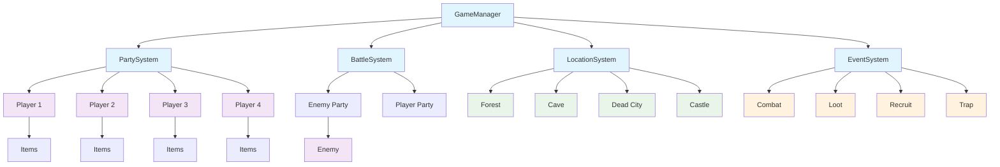

# Architecture of the Game "The Hunter's Path" (Darkest Dungeon Style)

## System Overview

The game is a turn-based RPG in the style of Darkest Dungeon with rogue-like elements. Main components:

### Main Entities
- **Entity** - basic entity with characteristics (HP, damage, defense, initiative, stamina)
- **Player** - playable character with inventory, equipment, and leveling system
- **Enemy** - enemy with experience for killing and difficulty level
- **Item** - items (weapons, armor, accessories, consumables)

## Architectural Components

### 1. Battle System (BattleSystem)
```cpp
class BattleSystem {
private:
    vector<Entity*> playerParty;    // Player party (up to 4 characters)
    vector<Entity*> enemyParty;     // Enemy party
    vector<Entity*> turnOrder;      // Turn order (based on initiative)
    int currentTurnIndex;           // Current turn

    // Positions on the battle line (0-3 for each side)
    vector<int> playerPositions;
    vector<int> enemyPositions;

    // Corpses on the battlefield
    vector<Entity*> playerCorpses;
    vector<Entity*> enemyCorpses;
};
```

**Battle Mechanics:**
- Turn order based on initiative (unit with initiative 20 acts twice as often)
- Positional system: attack only available targets
- Corpses block positions (need to "clear" to access back rows)
- Limited actions per turn (stamina)

### 2. Location System (LocationSystem)
```cpp
enum class LocationType {
    FOREST,         // Forest
    CAVE,           // Cave
    DEAD_CITY,      // Dead City
    CASTLE          // Castle (final boss)
};

class Location {
private:
    LocationType type;
    string name;
    string description;
    vector<Location*> connectedLocations;  // Connected locations
    vector<Event*> possibleEvents;         // Possible events
    bool isBossLocation;                   // Boss location
};
```

**Navigation Structure:**
```
Forest → Cave, Dead City
Cave → Castle, Dead City
Dead City → Castle, Forest
Castle → Cave, Forest (if not going to boss)
```

### 3. Event System (EventSystem)
```cpp
enum class EventType {
    COMBAT,         // Combat with enemies (60% probability)
    TREASURE,       // Loot find (20% probability)
    RECRUIT,        // New character joining (10% probability)
    TRAP,           // Trap (5% probability)
    REST,           // Rest/recovery (5% probability)
    BOSS            // Boss battle (only in castle)
};

class Event {
private:
    EventType type;
    string description;
    int difficultyLevel;              // Difficulty level (1-5)
    vector<Entity*> involvedEntities; // Enemies/characters
    vector<Item*> rewards;            // Rewards
    vector<Location*> nextLocations;  // Next locations after event
    vector<string> choices;           // Action choices for player

public:
    // Generate event based on location and progress
    static Event* generateEvent(Location* location, int partyLevel);
};
```

**Event Generation Mechanics:**
- **Event probabilities** depend on location type and party level
- **Event difficulty** scales with game progress
- **Dynamic generation** of enemies and rewards
- **Interactive choices** with consequences for the player

**Generation Algorithm:**
```cpp
Event* Event::generateEvent(Location* location, int partyLevel) {
    // Base probabilities for each location type
    map<LocationType, map<EventType, float>> baseProbabilities = {
        {FOREST, {{COMBAT, 0.6}, {TREASURE, 0.2}, {RECRUIT, 0.1}, {TRAP, 0.05}, {REST, 0.05}}},
        {CAVE, {{COMBAT, 0.7}, {TREASURE, 0.15}, {TRAP, 0.1}, {REST, 0.05}}},
        {DEAD_CITY, {{COMBAT, 0.65}, {TREASURE, 0.2}, {TRAP, 0.1}, {REST, 0.05}}},
        {CASTLE, {{BOSS, 1.0}}}  // Only boss in castle
    };

    // Adjust probabilities based on party level
    auto probabilities = adjustProbabilities(baseProbabilities[location->getType()], partyLevel);

    // Random selection of event type
    EventType type = selectEventType(probabilities);

    return createSpecificEvent(type, location, partyLevel);
}
```

### 4. Party System (PartySystem)
```cpp
class Party {
private:
    vector<Player*> members;          // Current party members (up to 4)
    vector<Player*> availableHeroes;  // Available heroes for hire
    vector<Item*> sharedInventory;    // Shared party inventory

public:
    bool addMember(Player* hero);     // Add hero to party
    bool removeMember(Player* hero);  // Remove hero (death)
    void distributeExperience(int exp); // Distribute experience
};
```

### 5. Main Game Manager (GameManager)
```cpp
class GameManager {
private:
    Party* currentParty;              // Current party
    Location* currentLocation;        // Current location
    BattleSystem* battleSystem;       // Battle system
    vector<Location*> worldMap;       // World map

    bool gameOver;                    // Game over flag
    int totalRuns;                    // Number of attempts

public:
    void startNewGame();              // Start new game
    void travelToLocation(Location* loc); // Travel between locations
    void handleEvent(Event* event);   // Handle event
    void gameOverScreen();            // Defeat screen
};
```

## Architecture Diagram



## Technical Features

### Initiative System in Battle
- Each turn calculates initiative weight: `initiative / 10`
- Unit with initiative 20 gets 2 turns per cycle, with initiative 10 - 1 turn
- Turn order is dynamically recalculated each round

### Positional Mechanics
- Battlefield is a line of 4 positions on each side
- Attack range=0: only first enemy line
- Attack range=1: first and second lines
- Attack range=2: all lines
- Corpses occupy positions until "cleared"

### Rogue-like Elements
- Permanent character death
- Random event and enemy generation
- No progress saving between runs
- Entire party death = game over

## Recommended File Structure

```
src/
├── entities/           # Game entities
│   ├── Entity.h
│   ├── Player.h
│   ├── Enemy.h
│   └── Item.h
├── systems/           # Game systems
│   ├── BattleSystem.h
│   ├── LocationSystem.h
│   ├── EventSystem.h
│   ├── PartySystem.h
│   └── GameManager.h
├── data/             # Game data
│   ├── Locations.h
│   ├── Events.h
│   └── Enemies.h
└── main.cpp          # Entry point
```

This architecture ensures modularity, extensibility, and clear separation of responsibilities between game components.